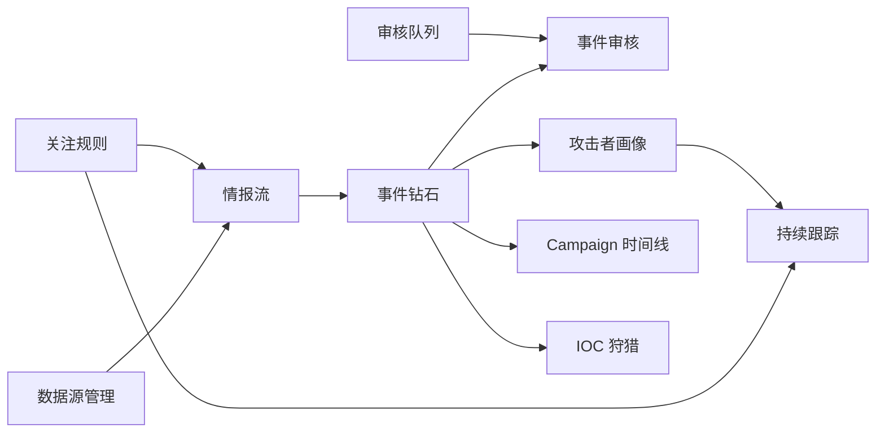

# 信息架构

## 1. 全局导航

桌面端使用固定侧边栏。全局顶部区域提供命令搜索、采集状态、待审核数量和账户入口。命令搜索可以查找事件、组织、Campaign、Observable、Indicator 和数据源。

## 2. 路由

| 路由 | 页面 | 关键参数 |
| --- | --- | --- |
| `/feed` | 情报流 | 来源、相关性、状态、日期、关注规则 |
| `/events/:eventId` | 事件钻石 | 关系过滤、证据面板 |
| `/events/:eventId/review` | 事件审核 | 审核任务、原文版本 |
| `/actors/:actorId` | 攻击者画像 | 时间范围、置信度 |
| `/campaigns/:campaignId` | Campaign 时间线 | 阶段、来源、状态 |
| `/hunt` | IOC 狩猎 | 查询值、类型、时间范围 |
| `/reviews` | 审核队列 | 类型、优先级、状态、负责人 |
| `/sources` | 数据源管理 | 类型、健康状态、启用状态 |
| `/watch-rules` | 关注规则 | 组织、技术、行业、关键词 |
| `/tracking/:actorId` | 持续跟踪 | 月、年、自定义日期、事件状态 |

页面筛选条件应进入 URL 查询参数，刷新或分享链接后可以恢复。

## 3. 页面规格

### 3.1 情报流

- 顶部：时间范围、来源、事件状态、关注规则和相关性阈值。
- 主列表：标题、来源、发布时间、采集时间、相关性分数、命中理由和候选实体。
- 行操作：查看原文、加入审核、忽略、与现有事件关联。
- 侧栏：本期关注组织、数据源健康、待审核摘要。
- 默认排序：相关性降序，再按发布时间降序。

### 3.2 事件钻石

- 中央画布：攻击者、能力、基础设施、受害目标四个节点。
- 关系必须显示置信度、审核状态和证据数量。
- 右侧详情：选中节点的属性、时间线、关联 Observable/Indicator 和证据。
- 底部来源区：构成该事件的所有 Report，不折叠掉互相矛盾的描述。

### 3.3 事件审核

- 左侧原文，右侧结构化候选，支持点击候选后定位证据片段。
- 接受、修改、拒绝操作必须可以逐字段执行。
- 批量接受仅适用于有确定性校验的低风险字段，例如格式有效的文件哈希。
- 保存草稿不改变事件发布状态；“完成审核”执行完整校验。

### 3.4 攻击者画像

- 身份区：规范名称、别名、描述、首次/最近活动时间。
- 统计区：事件数、报道数、活跃 Campaign、已确认 Indicator。
- 内容区：常用能力、ATT&CK 技术、目标行业/地区、基础设施变化。
- 每个趋势或结论都能下钻到构成它的事件。

### 3.5 Campaign 时间线

- 以时间轴展示侦察、初始访问、执行、持久化、横向移动、影响等阶段。
- 支持按证据来源和确认状态过滤。
- 事件可以属于 Campaign，但不能因为时间接近就自动确认归属。

### 3.6 IOC 狩猎

- 支持精确值、批量值和规范化值查询。
- 结果显示首次/最近出现时间、关联事件、来源、富化结果和恶意判断。
- Observable 与 Indicator 使用不同视觉状态和操作。
- “提升为 Indicator”必须要求用途、有效期、置信度和支持证据。

### 3.7 审核队列

- 类型：事件候选、归因、实体合并、关系、IOC 提升、Campaign 归属。
- 优先级由相关性、关注规则、风险和等待时间组成。
- 支持草稿、完成、拒绝和重新打开。

### 3.8 数据源管理

- 显示源类型、名称、最近成功时间、下次计划、最近错误和连续失败次数。
- 新建向导分为基础信息、凭据、抓取策略、测试和启用。
- 测试连接不自动保存凭据或启用数据源。

### 3.9 关注规则

- 条件支持攻击组织、别名、行业、地区、ATT&CK 技术、关键词和数据源。
- 动作支持提升相关性、创建审核任务、加入持续跟踪和站内提醒。
- 保存前提供最近历史数据的命中预览。

### 3.10 持续跟踪

- 时间模式：月、年、自定义。
- 自定义日期使用日期范围选择器，提供最近 7/30/90 天和今年至今。
- 选择日期后点击“应用”才执行查询。
- 区间不超过 31 天按日聚合，32–180 天按周，超过 180 天按月。
- 趋势、事件列表、变化统计、摘要和导出必须使用同一日期范围。

## 4. 通用状态

- **加载**：骨架屏保留最终布局，异步富化以局部状态显示。
- **空状态**：说明为什么没有数据，并提供调整筛选或添加数据源的操作。
- **失败**：展示可理解的原因、最近成功数据和重试操作。
- **部分完成**：明确列出成功和失败的处理阶段，不将部分结果伪装成最终结果。
- **过期数据**：富化信息超过其 TTL 后显示过期标识，原历史结果仍可查看。
