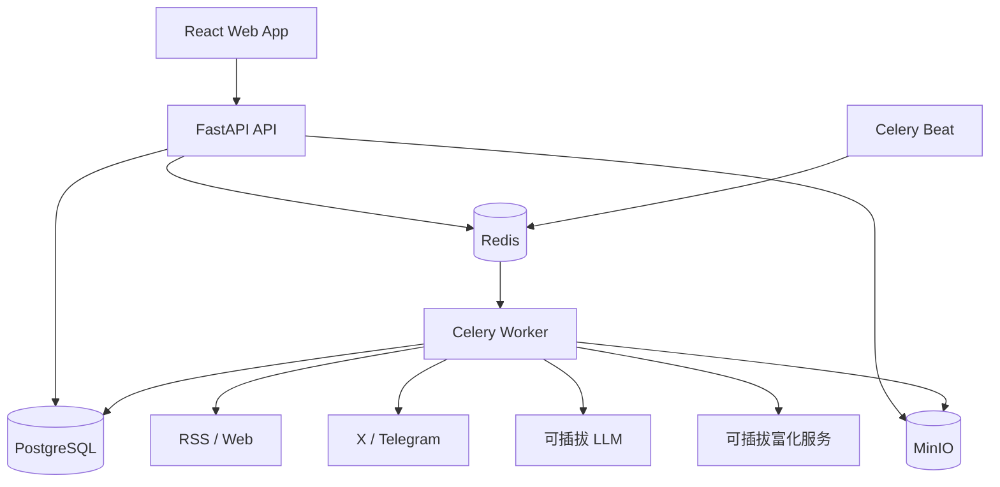
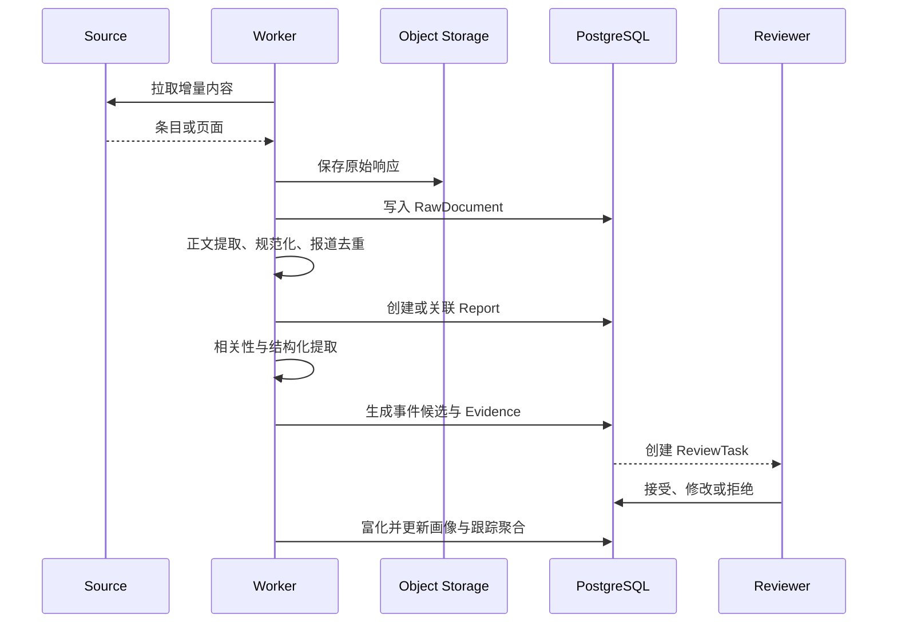

# 系统架构

## 1. 架构目标

MVP 采用模块化单体 API 配合独立异步 Worker。该形态可以在单台服务器上运行，又能把采集和分析等不稳定、耗时的工作与交互式 API 隔离。首版不拆微服务。



## 2. 技术栈

### 前端

- Vite + React + TypeScript；
- React Router：路由和可分享筛选状态；
- TanStack Query：服务端状态、缓存和失败重试；
- Tailwind CSS + shadcn/ui：组件和设计令牌；
- React Hook Form + Zod：表单和客户端校验；
- Recharts：趋势和分布图；
- Vitest + Testing Library + Playwright：测试。

### 后端

- FastAPI + Pydantic v2：HTTP API 和契约；
- SQLAlchemy 2 + Alembic：ORM 和迁移；
- PostgreSQL：业务数据、全文搜索、JSONB 扩展字段；
- Redis：任务代理、短期缓存、限速状态；
- Celery + Celery Beat：异步任务和周期调度；
- MinIO：原始响应、正文快照和导出文件；
- pytest：单元、集成和契约测试。

## 3. 后端模块

| 模块 | 职责 |
| --- | --- |
| `identity` | 本地账户、会话、CSRF、登录审计 |
| `sources` | 数据源配置、凭据引用、游标和健康状态 |
| `ingestion` | 拉取、抓取、内容归一化和原始归档 |
| `analysis` | 相关性、IOC/实体提取、LLM 语义分析 |
| `knowledge` | 事件、钻石实体、关系、Campaign 和证据 |
| `review` | 审核任务、决策、版本和撤销 |
| `hunting` | Observable/Indicator 检索和富化 |
| `tracking` | 关注规则、时间聚合、变化检测和摘要 |
| `exports` | CSV、JSON、报告和 STIX 兼容导出 |
| `operations` | 任务状态、健康检查、审计和系统配置 |

模块只能通过应用服务或稳定领域接口调用，不能跨模块直接修改表。

## 4. 前端分层

```text
app/          路由、Provider、全局错误边界
features/     feed、events、review、actors、campaigns、hunt、sources、tracking
components/   业务无关的共享组合组件
components/ui shadcn/ui 组件
lib/          API client、日期、格式化、权限与遥测
types/        由 OpenAPI 生成的接口类型
```

- 页面组件不直接调用 `fetch`，统一使用生成的 API client。
- 服务端数据只放在 TanStack Query；临时交互状态留在组件或 URL。
- 不为服务端对象建立第二套全局状态仓库。
- 大型页面按路由拆包，钻石画布和图表延迟加载。

## 5. 数据与任务流



## 6. 搜索策略

MVP 使用 PostgreSQL：

- `tsvector` 处理标题、正文摘要和描述全文搜索；
- `pg_trgm` 处理组织别名、恶意软件名和模糊匹配；
- Observable 另存规范化值并建立 B-tree 索引；
- JSONB 只用于来源特有的扩展元数据，不替代核心关系表。

当数据规模和查询指标证明 PostgreSQL 不足时再引入独立搜索引擎。

## 7. 缓存与一致性

- 详情和审核写操作不做客户端乐观提交；成功后使相关查询失效。
- 跟踪聚合缓存按 Actor、日期范围、时区、桶粒度和状态组成键。
- 对事件、关系或审核结果的修改通过领域事件清除受影响缓存。
- Redis 丢失不得造成业务数据丢失；持久任务状态和结果以 PostgreSQL 为准。

## 8. 外部适配器

统一接口：

```python
class SourceConnector(Protocol):
    def validate_config(self, config: dict) -> ValidationResult: ...
    async def test_connection(self) -> ConnectionTest: ...
    async def fetch(self, cursor: str | None) -> FetchBatch: ...

class SemanticAnalyzer(Protocol):
    async def analyze(self, document: AnalysisDocument) -> AnalysisResult: ...

class EnrichmentProvider(Protocol):
    async def enrich(self, observable: ObservableInput) -> EnrichmentResult: ...
```

外部响应必须经过 Pydantic 校验。供应商不可用时保存失败原因并重试，不能写入不完整的“成功”结果。
