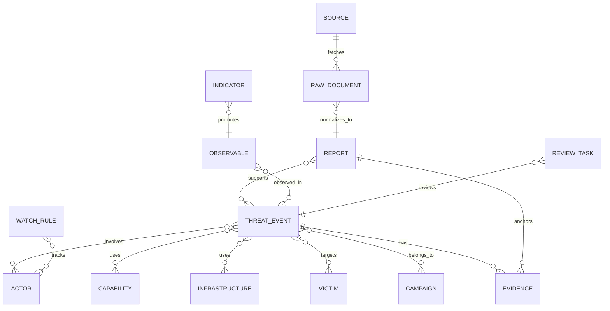

# 数据模型

## 1. 建模原则

- 原始内容、报道、事件和 Campaign 是不同层级，不可混用。
- 所有结构化结论通过 Evidence 追溯到来源或分析员判断。
- 自动结果与人工确认结果分别保存。
- 合并和编辑采用版本与重定向，不物理删除重要情报对象。
- 核心主键使用 UUID；外部 ID、规范化值和内容指纹设置唯一约束。

## 2. 核心关系

## 3. 主要实体

### Source

| 字段 | 类型 | 说明 |
| --- | --- | --- |
| `id` | UUID | 主键 |
| `type` | enum | `rss`、`web`、`x`、`telegram` |
| `name` | string | 显示名称 |
| `config` | JSONB | 非敏感连接配置 |
| `secret_ref` | string/null | 密钥存储引用，不保存密钥值 |
| `enabled` | bool | 是否调度 |
| `schedule` | string | Cron 表达式 |
| `cursor` | text/null | 增量游标 |
| `health_status` | enum | `healthy`、`degraded`、`failed`、`disabled` |
| `last_success_at` | timestamptz/null | 最近成功时间 |
| `consecutive_failures` | int | 连续失败次数 |

### RawDocument

- `source_id`、`external_id`、`canonical_url`；
- `fetched_at`、`published_at`、`http_status`、`content_type`；
- `raw_object_key`、`raw_sha256`；
- `processing_status`、`processing_error`；
- 唯一约束：`(source_id, external_id)`，没有 external ID 时使用规范 URL 与内容哈希。

### Report

- `title`、`language`、`author`、`published_at`；
- `canonical_url`、`normalized_text`、`summary`；
- `exact_hash`、`simhash`、`duplicate_of_id`；
- `relevance_score`、`relevance_reasons`；
- `status`: `new`、`analyzed`、`ignored`、`failed`。

### ThreatEvent

- `title`、`summary`、`first_seen`、`last_seen`；
- `status`: `candidate`、`in_review`、`confirmed`、`rejected`、`superseded`；
- `confidence_auto`、`confidence_analyst`；
- `dedupe_key`、`version`、`superseded_by_id`；
- 与 Report 为多对多，并记录每篇报道的支持或反证角色。

### 钻石实体

- `Actor`：规范名称、别名、描述、首次/最近活动时间。
- `Capability`：恶意软件、工具、漏洞、社会工程手法或操作能力。
- `Infrastructure`：域名、IP、服务器、账户、托管和通信设施的逻辑对象。
- `Victim`：组织、行业、地区、角色或资产类型；敏感个人信息不进入首版。

四类实体共享：规范名称、别名、描述、状态、自动/人工置信度和版本。

### Relationship

关系不只保存两端 ID，还应包含：

- `relationship_type`；
- `source_type` 和 `source_id`；
- `valid_from`、`valid_until`；
- `confidence_auto`、`confidence_analyst`；
- `review_status`；
- `created_by_analysis_run_id`；
- 一组 Evidence。

### Evidence

| 字段 | 说明 |
| --- | --- |
| `report_id` | 证据所在报道 |
| `raw_document_id` | 对应原始内容版本 |
| `quote` | 最小必要证据片段 |
| `start_offset/end_offset` | 在规范正文中的字符位置 |
| `locator` | 页码、段落、帖子 ID 等来源定位信息 |
| `evidence_type` | `direct`、`indirect`、`contradicting`、`analyst` |
| `created_by` | 规则、模型或用户 |

### Observable 与 Indicator

`Observable`：

- `type`：IPv4、IPv6、domain、url、email、md5、sha1、sha256、file-name 等；
- `value_original`、`value_normalized`；
- `first_seen`、`last_seen`；
- 格式校验状态和关联证据。

`Indicator`：

- 必须引用一个 Observable；
- `purpose`、`pattern`、`valid_from`、`valid_until`；
- `confidence`、`severity`、`revoked`；
- 至少一条恶意用途 Evidence 和一次人工确认。

### Campaign

- `name`、`description`、`first_seen`、`last_seen`、`status`；
- 关联事件及其 Campaign 归属置信度；
- 阶段采用受控枚举，并允许记录无法映射到阶段的事件。

### ReviewTask

- `type`: `event`、`attribution`、`entity_merge`、`relationship`、`indicator_promotion`、`campaign_membership`；
- `priority`、`status`、`subject_type`、`subject_id`；
- `decision`、`decision_reason`、`created_at`、`completed_at`；
- MVP 虽为单用户，仍保留 `assigned_to`。

### WatchRule

- `name`、`enabled`、`conditions`、`actions`；
- `match_mode`: `all` 或 `any`；
- `last_evaluated_at`、`last_match_at`；
- 条件使用版本化 JSON Schema 校验，不执行用户提供的代码。

## 4. 去重模型

### 报道级

1. 规范 URL 相同：直接视为同一内容来源的重复版本。
2. 正文 SHA-256 相同：标记精确重复。
3. SimHash 距离低于阈值：生成近似重复候选，不自动丢弃。
4. 转发和摘要仍可保留为独立 Report，但关联 `duplicate_of_id`。

### 事件级

事件相似分由时间重叠、Actor、基础设施、恶意软件、受害目标和关键 TTP 组成。达到阈值只生成合并候选；有归因冲突、受害目标明显不同或时间跨度异常时必须人工审核。

## 5. 时间与统计

- 所有时间字段使用 `timestamptz` 并存 UTC。
- `published_at` 表示来源发布时间，`fetched_at` 表示系统采集时间。
- 事件统计使用 ThreatEvent 的 `first_seen/last_seen` 与选定统计策略。
- 报道数通过关联 Report 单独计算，不能与事件数相加。
- 自定义日期查询采用左闭右开区间 `[from, to)`，API 对用户选择的结束日期自动转换为下一日本地零点。

## 6. 索引与约束

- Observable：`(type, value_normalized)` 唯一索引。
- Source：`(type, name)` 唯一索引。
- Report：`exact_hash`、`canonical_url`、`published_at` 索引。
- Evidence：`report_id` 和目标对象关联索引。
- ThreatEvent：`status`、`first_seen`、`last_seen` 复合索引。
- 所有关系表对两端 ID 和关系类型建立唯一约束，版本差异通过版本表保存。
