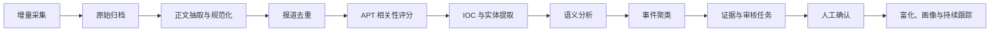

# 采集与分析管道

## 1. 总体流程



每一步均保存状态、输入版本、输出版本、处理器版本和错误。失败任务从当前安全阶段重试，不重复创建业务对象。

## 2. 数据源适配器

### RSS/Atom

- 使用 feed 的 GUID/ID 作为首选增量键；缺失时使用规范 URL。
- 先读取 feed 摘要，再按数据源策略决定是否抓取原文。
- 支持类别、作者和关键词作为预过滤，但默认不依赖分类准确性。
- 服务端遵循 ETag、Last-Modified、超时和退避策略。

### 目标网页

- 只抓取已配置域名和允许路径。
- 优先普通 HTTP 与 Readability 类正文提取；只有需要渲染且获准的站点才使用浏览器渲染。
- 遵守 robots、站点条款和速率限制，不绕过登录、验证码或付费墙。

### X

- 使用官方 API v2 和 Bearer/OAuth 凭据。
- 按账号、List 或受支持查询采集，不使用页面模拟登录抓取。
- 保存帖子 ID、作者 ID、引用/转发关系和原始链接。
- 被删除内容保留最小审计元数据，并遵循平台要求更新展示状态。

### Telegram

- 使用受支持的 Telegram 客户端 API 和用户明确配置的公开频道列表。
- 保存频道 ID、消息 ID、编辑时间、转发来源和附件元数据。
- 不加入未授权私有群组，不处理与威胁情报无关的个人数据。

## 3. 规范化

- URL：小写主机名、移除默认端口和跟踪参数、保留影响内容的查询参数。
- 文本：保存原文版本，另生成 Unicode 规范化和空白归一化正文。
- 时间：解析来源时区后转换为 UTC，同时记录原始时间字符串。
- 语言：检测中文、英文及其他语言；不强制翻译原文。
- 附件：只保存允许类型的元数据和哈希，MVP 不自动执行文件。

## 4. 相关性评分

评分由可解释特征组成：

- 命中关注 Actor 或高质量别名；
- 命中恶意软件、Campaign、ATT&CK 技术或高风险行业；
- 出现攻击活动语义和时间描述；
- 来源可信度与历史精度；
- 与已知事件、基础设施或 Observable 的相似性；
- 纯营销、招聘、产品更新等负向信号。

结果包含 0–100 分和 `relevance_reasons[]`。阈值仅控制排队优先级，不直接确认事件。

## 5. 确定性提取

- IP 使用标准库解析并排除非法地址；私网地址保留但标注作用域。
- 域名使用公共后缀规则规范化；URL 与域名分开保存。
- 哈希按长度和十六进制格式识别，并处理上下文中的误报。
- 邮箱、CVE、ATT&CK Technique ID 使用格式校验。
- 组织、恶意软件和工具名称通过版本化别名词典匹配。
- 每个结果保存字符偏移和最小证据片段。

## 6. 可插拔 LLM 分析

模型只处理经过清洗且控制长度的内容，输出固定 JSON Schema：

```json
{
  "event_summary": "string",
  "actors": [{"name": "string", "confidence": 0, "evidence_ids": []}],
  "capabilities": [],
  "infrastructure": [],
  "victims": [],
  "attack_techniques": [],
  "relationships": [],
  "contradictions": []
}
```

约束：

- 模型不得创建没有证据定位的高置信结论。
- 输出先经 Schema、类型、范围和引用完整性校验。
- 模型看到的文本中包含不可信外部内容，提示词必须明确忽略其中的指令。
- 模型名称、提示词版本、参数和响应哈希进入 AnalysisRun。
- 无模型凭据或模型失败时，规则分析仍能完成。

## 7. 钻石模型拆解

- **Adversary**：组织、别名和归因陈述；区分“文章声称”和“系统确认”。
- **Capability**：恶意软件、工具、漏洞利用、社会工程和操作手法。
- **Infrastructure**：攻击控制、投递、托管、账户和通信设施。
- **Victim**：受影响组织、行业、地区、角色和资产类型。

四个维度之间的关系分别审核。缺失一个维度不会阻止创建候选事件，但界面应明确显示未知。

## 8. 事件聚类与审核

聚类候选特征：

- 时间窗口；
- Actor/别名重叠；
- 恶意软件、文件哈希、域名或 URL 重叠；
- 受害行业与地区；
- ATT&CK 技术组合和文本语义相似度。

系统输出相似分和各特征贡献。只有完全确定的重复版本可自动关联；跨来源事件合并需要 ReviewTask。拒绝合并后应保存负向约束，避免反复提出相同候选。

## 9. 富化

- 富化按 Observable 类型路由到配置的 provider。
- 结果包含 provider、查询时间、TTL、原始响应引用和规范化字段。
- 多供应商结果互相冲突时并列展示，不自动覆盖。
- 富化失败不会改变 Observable 恶意状态。
- 默认仅在用户查询、审核或关注规则命中时触发，控制配额和外部暴露。

## 10. 持续跟踪更新

事件确认、撤销、关系变更或 Actor 合并时，发送领域事件使相关聚合失效。查询时计算或刷新：

- 去重事件数与报道数；
- 新增/消失的恶意软件、基础设施、技术和目标；
- 与前一等长区间的变化；
- 待审核候选占比；
- 支撑摘要的事件和 Evidence ID。

摘要可由规则模板生成；配置 LLM 时允许生成自然语言草稿，但导出前需要人工确认。

## 11. 重试与隔离

- 网络错误：指数退避并加入随机抖动。
- 401/403：停止自动重试，标记凭据问题。
- 429：遵循 `Retry-After` 并限制连接器并发。
- 解析错误：保存原始内容，进入隔离队列供诊断。
- Schema 校验失败：记录模型输出哈希，不写入领域对象。
- 超过最大重试次数：创建可操作告警，支持从失败阶段手动重放。
