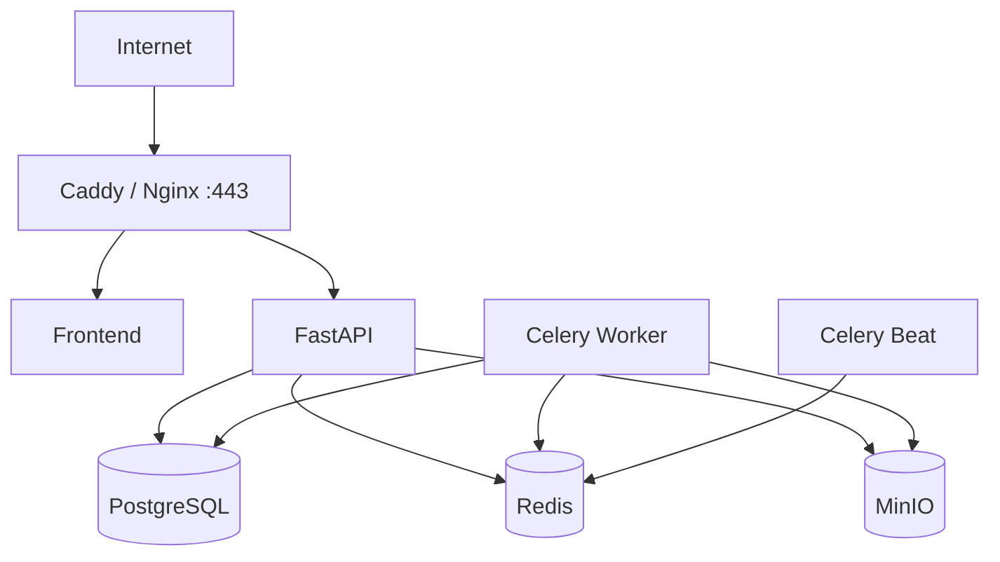

# 安全、部署与运维

## 1. 威胁边界

系统会处理不可信网页、帖子、附件元数据和模型输入，因此外部内容一律视为攻击者可控。主要风险包括：

- 网页正文中的提示注入或恶意指令；
- SSRF、重定向到内网和恶意大文件；
- 数据源、LLM 和富化服务凭据泄露；
- XSS、危险 URL 和富文本渲染；
- 错误归因或自动化结果被误当成已确认结论；
- 任务重放、重复写入和审计记录缺失。

## 2. 应用安全

- 本地账户密码使用 Argon2id，首次启动通过一次性管理命令创建。
- 会话使用 Secure、HttpOnly、SameSite=Lax Cookie；生产环境只接受 HTTPS。
- 所有写请求验证 CSRF token 和 Origin。
- 登录按 IP 与账户组合限速，连续失败写入审计。
- 前端不渲染来源 HTML，只展示经过转义的纯文本或严格白名单 Markdown。
- 外部链接显示实际域名并使用 `rel="noopener noreferrer"`。
- 所有对象修改采用服务端字段白名单和版本检查。

## 3. 抓取安全

- 只允许 `http` 和 `https`，解析 DNS 后拒绝环回、链路本地、私网和保留地址。
- 每次重定向重新执行地址校验，设置最大重定向次数。
- 限制响应体大小、压缩展开比例、下载时间和 MIME 类型。
- 抓取器运行在无特权容器，不挂载宿主 Docker socket。
- MVP 不执行附件、不运行宏、不打开压缩包中的文件。
- 浏览器渲染如启用，应使用隔离容器、临时用户目录和严格并发限制。

## 4. 模型与富化安全

- 系统提示明确把来源正文视为数据，不执行其中的指令。
- 只发送完成分析所需的最小正文和元数据。
- 模型返回仅作为候选，经 Schema 校验后才能保存。
- 密钥通过服务器端 secret 文件或环境变量注入，不进入前端和日志。
- 对外富化前显示数据暴露策略；内部或私有 Observable 默认不发送第三方。

## 5. 部署拓扑

MVP 使用独立 Docker Compose：

只对外开放 443。PostgreSQL、Redis、MinIO 和 Worker 仅位于内部 Docker 网络。管理端口如需临时访问，应通过 SSH 隧道。

## 6. 单机资源基线

针对约 2 核 CPU、5–6 GB 内存的起始环境：

| 服务 | 建议内存上限 | 说明 |
| --- | --- | --- |
| PostgreSQL | 1.2 GB | 限制连接池和 shared buffers |
| API | 700 MB | 1–2 个进程 |
| Worker | 1.2 GB | 默认并发 2，浏览器任务单独队列并发 1 |
| Redis | 300 MB | 设置 maxmemory 和淘汰策略 |
| MinIO | 500 MB | 限制并发和生命周期策略 |
| Web/Proxy/Beat | 300 MB | 静态资源和轻量调度 |

保留至少 1 GB 系统余量。若启用本地模型、批量浏览器渲染或高频社交采集，应扩容或将任务移至独立 Worker。

## 7. 配置与密钥

- 非敏感配置使用 `.env`，仓库只提供 `.env.example`。
- Secret 文件权限为仅部署账户可读。
- 数据源表只保存 `secret_ref` 和脱敏后的凭据状态。
- 配置启动时通过 Pydantic Settings 校验，缺少必要值应失败并指出字段。
- 所有环境分别使用独立数据库、对象桶和加密密钥。

## 8. 备份与恢复

- PostgreSQL：每日逻辑备份，至少保留 7 个日备份和 4 个周备份。
- MinIO：原始内容和导出文件按生命周期分层；关键桶参与增量备份。
- Redis 不作为唯一数据源，不要求业务级恢复。
- Secret 不打包进普通备份，单独加密保存。
- 每月至少执行一次恢复演练：恢复数据库、对象数据并验证 Evidence 引用。

恢复点目标 RPO 为 24 小时，恢复时间目标 RTO 为 4 小时。进入正式生产前可根据数据价值缩短。

## 9. 日志、指标与告警

- JSON 结构化日志包含 `request_id`、`job_id`、`source_id`，不记录正文全文和密钥。
- 指标：采集成功率、连续失败、队列深度、任务时长、报告/事件产量、审核积压、模型失败率、富化配额。
- 告警：数据源连续三次失败、队列持续堆积、磁盘低于 15%、备份失败、认证异常增长。
- `/health/live` 只检查进程；`/health/ready` 检查关键依赖并设置短超时。

## 10. 数据保留

- 原始响应默认保留 180 天，可按来源配置更短期限。
- 规范正文、Evidence 和已确认事件在事件存在期间保留。
- 临时导出默认 7 天后删除。
- 审计日志至少保留 365 天。
- 删除数据源不会级联删除已经用于事件和 Evidence 的历史数据。

## 11. 发布与回滚

- 镜像使用不可变版本标签，不使用 `latest`。
- 部署前备份数据库并运行 Alembic 迁移预检。
- 数据库迁移采用向后兼容的 expand/contract 策略。
- 健康检查通过后才切换反向代理流量。
- 回滚应用版本时，不执行破坏性降级迁移；必要时从备份恢复到新实例。
